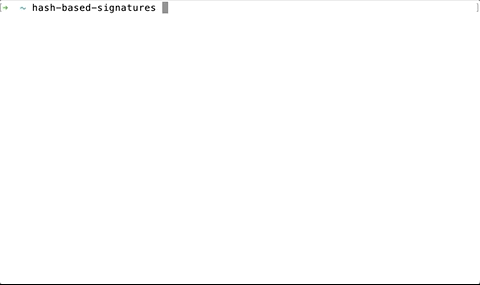

# Hash-based signatures

A Rust implementation of hash-based signatures. See my [Medium post](https://medium.com/@georgwiese/hash-based-digital-signatures-almost-from-scratch-da57e54dd774) for a longer description!

***Disclaimer:** This repository is a toy project to play around with Rust and cryptographic primitives.
It implements some ideas of Chapter 14 of ["A Graduate Course in
Applied Cryptography"](http://toc.cryptobook.us/) by Dan Boneh and Victor Shoup.*

Hash-based signatures - unlike signature schemes based on RSA or ECC - do not rely on number-theoretic assumptions that are known to be broken by Quantum computers.

Stateless many-time signature schemes can be built in a three-step process:
1. A one-time signature scheme can be built purely from hash functions.
2. From there, we build an indexed signature scheme.
   Using a Merkle tree, the otherwise very large public key can be reduced to a single hash
   (at the expense of a larger signature).
3. Finally, Merkle signatures build a tree of indexed signature schemes.

## Command line tool

[Install Rust](https://www.rust-lang.org/tools/install) and run:
```
$ cargo install hash-based-signatures
```

This gives you a command-line tool that lets you generate keys, sign files, and validate signatures:



To get started with signature verification, check out [the example](./example)!

To sign files, run:
```bash
$ cargo run -- key-gen
```

This will create a `.private_key.json` in your working directory and print the corresponding public key.
Keep it private!

To sign a file, make sure that you have a `.private_key.json` in your working directory and run:
```bash
$ cargo run -- sign example/readme.md
```

## Web app

Last but not least, signatures can also be verified using a web app, based on a Web Assembly compilation of the code:

https://georgwiese.github.io/hash-based-signatures/